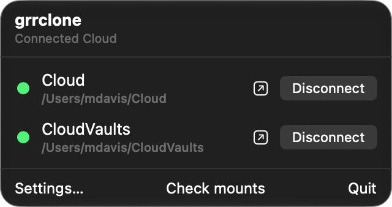
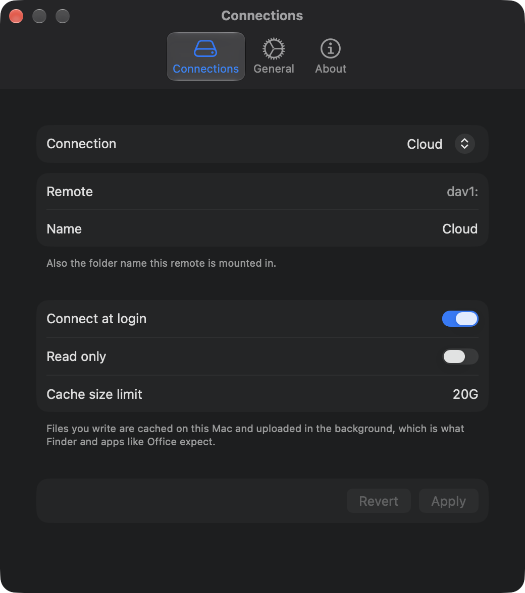

# grrclone

A free, open-source macOS menu bar app that connects [rclone](https://rclone.org)
remotes as Finder volumes.

No licence key. No phone-home. No kernel extension. No root.

<p align="center">
  
</p>

## Why this exists

Because the options were bad. There are very few rclone GUIs for macOS, the few that
exist mostly cost money, several phone home, and the rest are some combination of
incomplete, awkward and buggy. Paying a licence fee to mount a drive you already own,
using a tool that is already free, is a strange place to end up.

So grrclone is the app that should have existed: it mounts your remotes, it stays out
of the way, it asks for nothing, and it tells no one.

## Install

```bash
brew install --cask mlaify/tap/grrclone
```

Or download the latest DMG from
[Releases](https://github.com/mlaify/grrclone/releases) and drag it to Applications.
Either way it is signed and notarised, so Gatekeeper opens it without argument.

Apple Silicon only. Requires macOS 14 or later.

<details>
<summary>Why a tap rather than plain <code>brew install --cask grrclone</code></summary>

homebrew-cask requires a project to be "notable" — 75 stars, or 30 forks, or 30
watchers. grrclone has none of those yet, and Homebrew is one of the ways people
would find it, so the requirement is circular for something new. The cask passes
audit; only that rule fails. It will go to homebrew-cask unchanged once the bar is
met.

Homebrew owns installs: `brew update && brew upgrade --cask grrclone`. If you would
rather not remember that, [`brew autoupdate`](https://github.com/DomT4/homebrew-autoupdate)
can run it on a schedule. It is a third-party tap, not part of Homebrew, so it has to
be installed first:

```bash
brew tap domt4/autoupdate
brew autoupdate start --upgrade
```

**It upgrades everything Homebrew manages, not just grrclone** — that is the whole
feature, and worth knowing before you turn it on. Without `--upgrade` it only
refreshes metadata, which still means `brew upgrade --cask grrclone` finds a new
version immediately instead of up to 24 hours later.

grrclone neither requires nor assumes any of this; it will simply stop mentioning
versions you already have.

grrclone can be asked to
*check* for new releases, but it never replaces its own bundle — two updaters owning
one app is how a self-updating copy gets silently downgraded by the next upgrade.
Release candidates are not served by the cask; they come from the releases page.

</details>

It appears in the menu bar with no Dock icon, finds the remotes already in your
`rclone.conf`, and lists them.

<p align="center">
  
</p>

## What it does

Auto-discovers your rclone remotes, connects and disconnects them, reconnects at login,
and repairs mounts after sleep or a network change. Per-connection settings for the
mount name, read-only and cache size. Tears mounts down in the right order when you
quit, so Finder never hangs on a dead server.

Mounts land in a folder of your choosing — `~/grrclone` by default, and settable in
Settings, so grrclone can take over the paths an existing setup already uses.

**Encrypted `rclone.conf`.** If your config is encrypted, grrclone asks for the
password and can remember it in your keychain.

**A bandwidth limit**, applied to the running transfer immediately — no restart, no
remounting.

**A log viewer**, so a failed mount can be diagnosed without a terminal. Passwords and
credentials in URLs are removed before anything is shown.

**Survives a bad shutdown.** A folder with nothing mounted on it is left unwritable,
so a crash cannot leave a directory that silently swallows files the next mount would
hide. If it finds any, it says so and offers to move them somewhere safe rather than
merging them anywhere.

## Four things no other rclone GUI does

Every one of these is in the repository and can be checked. They are the reason
grrclone exists as something other than a nicer button for `rclone mount`.

**1. It will not unmount a volume it did not create.** In the kernel's mount table, a
mount you made by hand with `rclone nfsmount` is indistinguishable from grrclone's
own — same `localhost:/` source, same owner, same everything. Any cleanup that decided
ownership by pattern-matching that table would force-unmount your volumes, possibly
mid-write. So grrclone unmounts a path *only* if that exact path is in its own
registry, written before the mount is attempted. Source, port and process name are
never accepted as evidence. Volumes it can see but does not own are listed in the menu
under "Not managed by grrclone", so the boundary is visible rather than implied. No
other client draws this line, because no other client assumes you were already running
rclone yourself.

**2. It mounts with options that keep Finder alive.** Everything that wraps
`rclone nfsmount` or the `mount/mount` endpoint inherits macOS's default **hard,
non-interruptible** NFS mount, because those paths hardcode their option set. When the
backend dies you get a beachball and processes stuck in uninterruptible sleep. grrclone
performs the mount itself with `soft,intr,timeo=600,retrans=2` so a dead backend
returns an error, and `nolocks,locallocks` so anything taking a file lock does not hang
forever on a lock daemon rclone does not run. Measured: an error after **7.1 seconds**
and a clean recovery, no reboot.

**3. Credentials are stripped from logs on the way in, not on the way out.** The log
viewer has a copy button, so a redaction step that runs at display time is one
forgetful caller away from leaking. grrclone redacts as each line arrives, before it is
ever stored — `Authorization` headers, cookies, AWS request signatures, credentials
embedded in URLs, rclone's own control-socket password. A line is reassembled first if
a read split it mid-secret. The secret is never in memory in the clear, so there is no
path that can forget.

**4. The privacy promise is a build failure, not a sentence in a README.**
`scripts/check-privacy.sh` runs in CI on every pull request and fails the build if a
telemetry SDK appears, if a server is bound to anything but loopback, if update checks
become on-by-default, if a new outbound host shows up, or if App Transport Security is
weakened. It scans uncommitted files too, because the moment you most want the check to
be honest is while you are writing the thing it would catch.

Mountain Duck, CloudMounter and ExpanDrive are all closed source, so none of this is
checkable in any of them at any price. The open-source clients are file browsers rather
than mount managers and do not attempt it.

## How it works, and why that matters

grrclone runs one bundled `rclone` daemon, starts an NFS server on loopback per
connection, and **performs the mount itself**.

That last part is the whole design. It deliberately avoids `rclone nfsmount` and the
`mount/mount` endpoint, because both hardcode their mount options and leave you with
macOS's default **hard, non-interruptible** mount — so when the backend dies, Finder
beachballs and processes wedge until you reboot. grrclone mounts with:

```
soft,intr,timeo=600,retrans=2,nolocks,locallocks,nfc,rsize=131072,wsize=131072
```

Measured with the server killed under a live mount: an error after **7.1 seconds** and
a clean recovery, no reboot. `nolocks` is there because rclone's NFS server runs no lock
daemon, so anything taking a file lock — SQLite, Office, Adobe — would otherwise hang
waiting on a daemon that does not exist.

Throughput against a real WebDAV remote over the internet:

| | `rclone copy` | through the mount |
|---|---|---|
| Cold read | 15.0 MB/s | 9.2 MB/s |
| Write, end to end | 15.3 MB/s | 11.9 MB/s |
| List 1,000 entries | 1.79 s | 0.64 s |

Method and full numbers in [docs/benchmarks.md](docs/benchmarks.md).

## What it cannot do

Three limits worth knowing before you rely on it, each a consequence of NFSv3 rather
than something grrclone chose. [docs/limitations.md](docs/limitations.md) has the
detail and the measurements.

**File locks are not shared between Macs.** rclone's NFS server runs no lock daemon,
so locks are satisfied locally — without that, anything taking one would hang forever.
Two Macs can each believe they hold an exclusive lock on the same KeePass database.

**`._` files appear beside almost everything.** NFSv3 cannot store extended
attributes, and macOS attaches one to every copy. `--no-appledouble` is a FUSE flag
that does not exist here, and filters do not help. The related `.DS_Store` problem
*is* solved, in Settings.

**A dead backend gives an error, not a hang** — after about two minutes. That is the
deliberate trade: the alternative wedges Finder until you reboot. Writes usually
survive it, because they land in a local cache first.

## Privacy

- No telemetry, no analytics, no crash reporting.
- No update check unless you turn one on. When you do, grrclone asks GitHub once a
  day which releases exist and nothing else — no version, no machine details, no
  identifier — and it never downloads or installs anything on its own. The link it
  offers you is built from the repository name and the tag, never from GitHub's
  reply, so a tampered response cannot point it somewhere else.
- No accounts, no licence keys, no gated features.
- **One permission, asked once.** If you turn on update checks, macOS asks whether
  grrclone may notify you — so it can tell you a new version exists. That is the only
  permission it ever requests, it is asked at the moment you opt in rather than at
  first launch, and saying no costs you nothing but the notification: the check still
  runs and the menu bar icon still marks an available update.
- The only outbound connections are to the storage providers you configure.
- The rclone control API is bound to a unix socket with `0600` permissions and random
  per-launch credentials. Nothing listens on the network, not even loopback. If the
  system cannot supply random bytes, grrclone refuses to start rather than fall back to
  something predictable.
- Credentials are stripped from log lines as they arrive, before being stored — not at
  display time, where a future caller could forget.
- The bundled rclone is pinned and checksummed at build time, never downloaded at
  runtime.
- Every release carries a Sigstore-signed provenance attestation in a public
  transparency log, so you can check which commit and workflow built the exact file
  you downloaded: `gh attestation verify grrclone.dmg --repo mlaify/grrclone`.

grrclone **reads** your `rclone.conf` but never writes it, so your command-line setup
keeps working exactly as before. A CI check fails the build if any of this regresses.

## Building it yourself

```bash
brew install xcodegen
swift scripts/make-icon.swift                 # the icon is generated, not committed
iconutil -c icns build/AppIcon.iconset -o App/grrclone/Resources/AppIcon.icns
scripts/fetch-rclone.sh                       # pinned and checksummed
scripts/build-app.sh
```

The icon and the bundled rclone are both generated rather than committed, so a fresh
clone needs those two steps before the app will build.

The logic lives in Swift packages that build and test without Xcode, and `grrclonectl`
drives them from a terminal:

```bash
swift build && swift test

.build/debug/grrclonectl doctor              # environment check
.build/debug/grrclonectl remotes             # remotes from rclone.conf
.build/debug/grrclonectl connect dav1 Cloud  # serve and mount
.build/debug/grrclonectl mounts              # what it owns, and what it does not
.build/debug/grrclonectl recovery-test dav1  # kill the server, verify self-repair
```

rclone 1.74.4 is the minimum, and releases bundle a pinned copy. Earlier versions have
NFS defects that cause stale file handles, failed file creation and broken listings of
large directories.

## More

- [docs/limitations.md](docs/limitations.md) — what grrclone cannot fix, and why
- [docs/migrating.md](docs/migrating.md) — moving from a hand-rolled launchd mount
  without changing your paths
- [docs/benchmarks.md](docs/benchmarks.md) — why NFS, the numbers, and the defects found
  along the way
- [docs/progress.md](docs/progress.md) — what is done, what is next, decisions taken
- [CHANGELOG.md](CHANGELOG.md) — what changed in each release
- [CONTRIBUTING.md](CONTRIBUTING.md) — including the rules that are not negotiable
- [SECURITY.md](SECURITY.md)

## Prior art

[Mountain Duck](https://mountainduck.io) is the app to beat and is genuinely good — it
is also proprietary and paid. [macsh](https://github.com/AyonPal/macsh) is the closest
open-source relative. [Rclone Browser](https://github.com/kapitainsky/RcloneBrowser) was
the classic and is no longer maintained.

## Licence

[MIT](LICENSE). grrclone is not affiliated with the rclone project.
